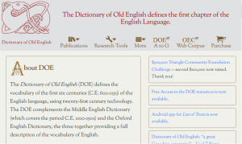
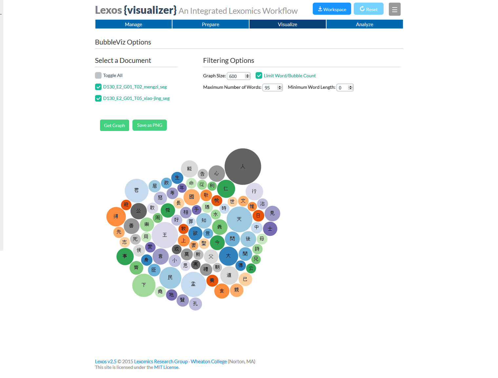
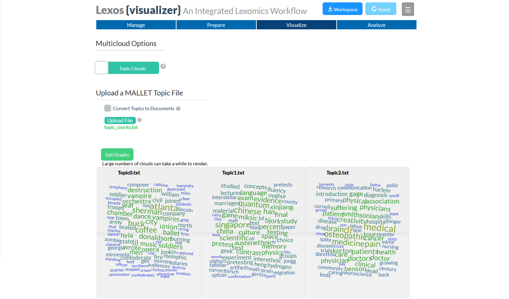
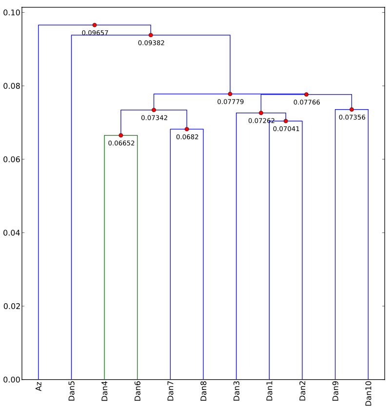
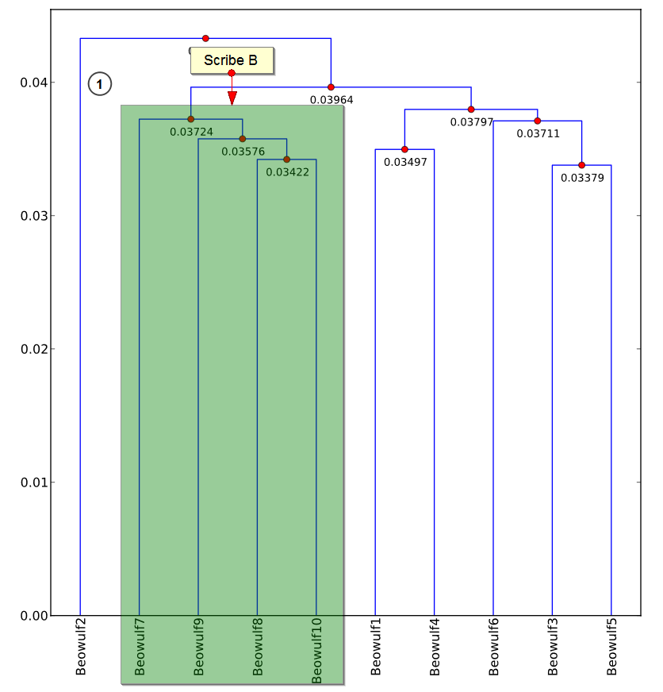
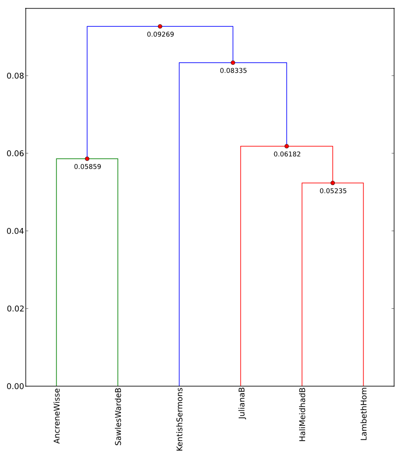
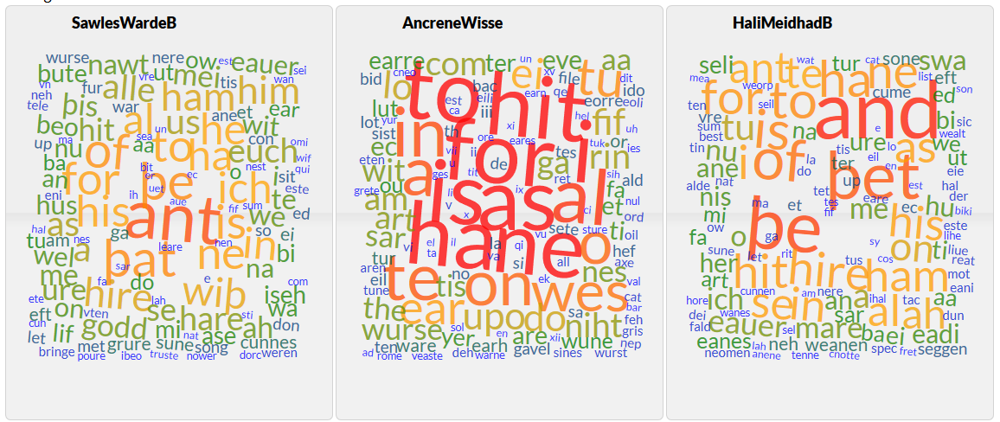
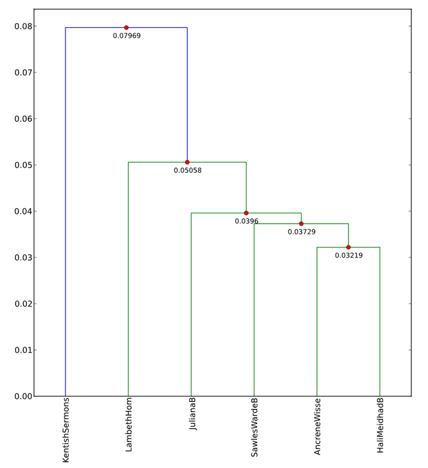
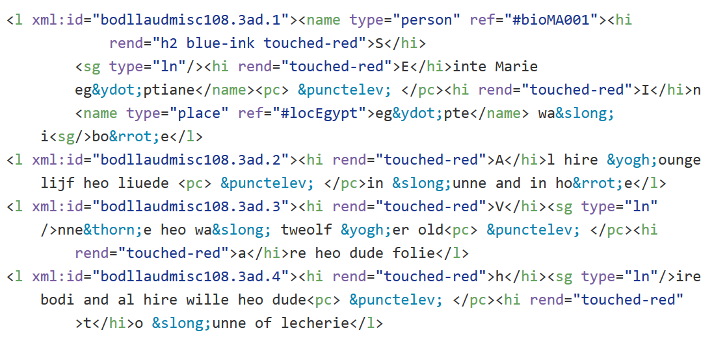

*Published on 15 March 2016 10:00 AM*

**Update March 15 2016:** This content was selected for [Digital Humanities Now](http://digitalhumanitiesnow.org/2016/03/digital-humanities-projects-with-small-and-unusual-data-some-experiences-from-the-trenches/){target="_blank"} by Editor-in-Chief Joshua Catalano based on nominations by Editors-at-Large: Ann Hanlon, Harika Kottakota, Heather Hill, Heriberto Sierra, Jill Buban, Marisha Caswell, Nuria Rodriguez Ortega. The slides have now been integrated, and they can also be seen in a [reveal.js](http://lab.hakim.se/reveal-js/#/){target="_blank"} presentation [here](http://scottkleinman.github.io/revealjs-presentations/UCI-Symposium/dh-projects-with-small-and-unusual-data.html#/){target="_blank"}.

This is an edited version of a talk I gave at UC Irvine on February 5, at a [Symposium on Data Science and Digital Humanities](http://datascience.uci.edu/event-registration/?ee=44){target="_blank"} organized by Peter Krapp and Geoffrey Bowker.

I’ve made the focus of my talk Digital Humanities projects involving small and unusual data. What constitutes small and unusual will mean different things to different people, so keep in mind that I’ll always be speaking in relative terms. My working definition of small and unusual data will be texts and languages that are typically not used for developing and testing the tools, methods, and techniques used for Big Data analysis. I’ll be using “Big Data” as my straw man, even though most data sets in the Humanities are much smaller than those for whom the term is typically used in other fields. But I want to distinguish the types of data I will be discussing them from large corpora of hundreds or thousands of novels in Modern English which are the basis of important Digital Humanities work. I’ll also be primarily concerned with the application of machine-learning, statistical, and quantitative approaches to the analysis of unstructured texts, which forms one part of what might be called the core of activity in the Digital Humanities. But the issues I’ll be addressing overlap significantly with other DH activities such as the application of linked data and digital editing.

Topic modelling is a good example of such a tool. It was originally designed for search and retrieval in data sets that are too large to be adequately parsed by the human mind, but there have now been many successful applications of the technique in literary and historical studies. As Humanities data sets grow, we can confidently say that Big Data is the future, promising to open up new pathways and questions for humanistic study. However, the “critical” side of the Digital Humanities has expressed a degree of scepticism about the interpretation of big data sets without ever consuming their content by traditional means. I think this is a tremendous oversimplification of how this type of work is being done, but it does at least identify a potential drawback to the hermeneutics enabled by Big Data. Another is that these large corpora are not necessarily "representative" collections; the ways in which large archives are collected can under-represent or omit entirely works by women and ethnic minorities, texts in multiple languages, or texts from diverse regions or historical periods. Because we recognise that this as a problem, I’m at least hopeful about current efforts to remedy it. But there is another class of texts that are often marginalised in our research environment: texts that *are* currently available in digital form, albeit not so many as we would like, and not necessarily in forms that are easy to analyse in the same way as materials which we can process at greater scales.

I like to think of the interpretive process in the Humanities as involving:

1. Primary texts (data)
2. Disciplinary expertise (metadata on speed)
3. Interpretive acts (close reading, synecdoche, rhetorical persuasion)

Together, these form a hermeneutic circle which can operate happily without quantitative analysis. But it is worth pointing out that the use of computational approaches can have tremendous benefits for students, who may not have read as many of the texts, lack the wide contextual knowledge of experienced scholars, and are still developing their interpretive skills. I find that applying such techniques encourages them to focus on details, to seek out contexts for understanding the numbers, and develop speculative explanations. If are teaching texts from the distant past, in different languages, or with other unusual characteristics, it is truly valuable to have a means of teaching using machine learning techniques, even if they are not strictly necessary for those who already have considerable disciplinary content knowledge. I’ll have more to say about the interplay between students and Digital Humanities research below.

Let me use my own area, medieval English literature, as an example of the challenges we face in applying such techniques. The quantity of texts that survive from the Middle Ages, particularly in the vernacular, is quite small. The entire corpus of Old English literature, for instance, comes to only 24 MB of data.

<figure markdown="span">

{ width="400" }

<figcaption><a href="http://doe.utoronto.ca/pages/index.html" target="_blank">The Dictionary of Old English Corpus</a></figcaption>

</figure>

This is not to say that we can’t have bigger data sets in medieval studies. Throughout my student and professional life, there has been a growing interest in the materiality of the medieval text, which has sent scholars away from their critical editions and back to the original manuscripts. In the last year, major libraries like the British Library and the Bodleian have embarked on revolutionary mass digitisation projects, creating open access resources in which a single image of a manuscript page is likely to take up more memory than 24 MB.

<figure markdown="span">

{ width="400" }

<figcaption><a href="http://www.bl.uk/manuscripts/Viewer.aspx?ref=cotton_ms_tiberius_a_vi_f001r" target="_blank">London, British Library, Cotton Tiberius A vi, f. 1r, recently digitised</a></figcaption>

</figure>

This promises to provide us with a rich new source of data, but one largely unusable with our current machine-learning methods because the images are untranscribed and because transcription cannot be automated. With a few exceptions, we are left using scanned editions of text, mostly from the nineteenth century, because they are out of copyright.

> But really, Digital Humanities Nineteenth-Century Studies?

It is no accident, that the joke runs that Digital Humanities is becoming Nineteenth-Century studies. That is the period in which collections of texts are accessible in the largest numbers and in a form amenable to machine processing (though [we have seen from Kathy Harris](https://triproftri.wordpress.com/2016/02/05/uc-irvine-talk/){target="_blank"} that there is no guarantee that texts are available even in this period).

The common wisdom about smaller data sets like the corpus of Old English is that they are best approached using traditional interpretive methods. It’s not that machine learning tools don’t work on them; it’s just that the insights you get provide little added value. You tend to get what you already know and not much else. I would add a further concern. When we machine-learning techniques do detect patterns that surprise us, we are forced to doubt the statistical significance of these patterns because of the small size of the data. This issue of statistics and scale is not to be dismissed lightly, and we need to develop some clear ideas about how to address it.

We also have concerns about how the techniques we are using deal with the idiosyncrasies of particular types of data sets. Even Big Data analysts face such idiosyncrasies, the most common one being imperfect OCR. Typically, however, these analysts correct what OCR errors they can and rely on larger statistical patterns to smooth over effects created by the remainder, along with occasional spelling variants or other irregular forms. But the further back in time you go, the less confident you can be of this smoothing effect. In the case of medieval literature, a huge stumbling block is the immense dialectal variety and the lack of a standardised spelling system. Other linguistic situations create different problems. For instance, languages like Chinese and Japanese do not separate words with spaces, making them a challenge to parse into tokens for counting. One observation I can make is that these types of situations frequently do not figure in the development of machine-learning techniques, leaving a vacuum in our knowledge of how to apply them. Perhaps more importantly, these kinds of issues mean that the stakes are higher in the decisions you make at the pre-processing stage before you ever submit texts to a statistical algorithm.

Now is where I’ll get to some experiences from the trenches, as it were, in order to illustrate some of the issues and begin to suggest some ways of addressing them. For some time, I’ve been involved in the [Lexomics Project](http://wheatoncollege.edu/lexomics/){target="_blank"} based out of Wheaton College in Massachusetts. The term Lexomics has evolved over the years and is now mainly a euphemism for the kinds of statistical approaches we’ve used to date and the constant back and forth between computational and traditional methods of analysis. The project is notable for being a collaboration between faculty and undergraduates (mostly in English and comp sci majors), and for developing its own software tool [Lexos Project](http://lexos.wheatoncollege.edu/){target="_blank"}, in response to the needs of the research, and its research in response to the functionality of the software.

<figure markdown="span">

{ width="400" }

<figcaption>Screenshot of Lexos with Chinese word cloud</figcaption>

</figure>

Lexos is intended to be a powerful tool that can still serve as an entry-point for scholars and students new to computational text analysis. It can be downloaded and run on your local machine, but we also have a version you can use over the internet.

<figure markdown="span">

{ width="400" }

<figcaption>Lexos Multicloud showing part of a topic model of <em>The New York Times</em> produced by Alan Liu</figcaption>

</figure>

In the course of developing Lexos, we have learnt the importance of offering a complete workflow, one that foregrounds the decision-making process as you are preparing your texts for analysis. This emphasis on workflow is one of the take-away experiences I’ve had in working on the project.

The primary statistical method we have used in our research is hierarchical agglomerative clustering, which gathers texts or segments of texts into groups based on the similarity of their word frequencies. The result is frequently represented as a tree diagram called a dendrogram. The technique is particularly good at identifying changes in authorship―which is what it is most often used for―but we have had found it effective in exploring questions about source material and source language. An example from our earliest research is our analysis of the Old English poems *Azarias* and *Daniel*. Our cluster analysis illustrates that one segment of *Daniel* shows clear affinities with *Azarias*.

<figure markdown="span">

{ width="400" }

<figcaption>Cluster analysis of <em>Daniel</em> and <em>Azarias</em> generated by Lexos</figcaption>

</figure>

As it happens, this has been known since the nineteenth century, and the theory is that they both derive from the same source material. What was significant to us, other than the fact that we could use cluster analysis to duplicate the findings of traditional philology, was that we could do it with text segments as small as 650 words and that we could do it using Old English, which has considerable spelling variation.

Here are some examples from *Beowulf* provided by Katherine O’Brien O’Keeffe in *Visible Song*.[^1^]

<table>
<tr>
  <td>eaðe/eaþe/yðe</td>
  <td>licgan/licgean</td>
</tr>
<tr>
  <td>fah/fag</td>
  <td>maþmum/madmum</td>
</tr>
<tr>
  <td>feaxe/fexe</td>
  <td>sellic/syllic</td>
</tr>
<tr>
  <td>gedryht/gedriht</td>
  <td>wlonc/wlanc</td>
</tr>
<tr>
  <td>gæst/gast</td>
  <td>libban/lifcgan</td>
</tr>
<tr>
  <td>yldum/eldum</td>
  <td></td>
</tr>
</table>

These all represent the same grammatical forms, but, since Old English is a heavily inflected language, we might get further variations such as *maþme*, *maþmes*, *maþma*, and *maþmas*.

In *Beowulf*, cluster analysis divides the poem in two because the one surviving manuscript was written by two scribes with different writing practices.

<figure markdown="span">

{ width="400" }

<figcaption>Cluster analysis of <em>Beowulf</em> showing Scribe B</figcaption>

</figure>

But it doesn’t tell us much about the origins, sources, or thematic patterns of the poem―if anything, it obscures them. Our immediate instinct is to try to erase the scribal influence by normalising the spelling and maybe even lemmatising the text. In our early experiments, however, we found that the unmodified text yielded cluster patterns that duplicated insights from traditional methods of analysis, whilst normalised and lemmatised texts obscured these patterns. We initially thought that these interventions reduced the dimensionality of the data below some threshold necessary to be useful for interpretation, and that might still be the case. But I think the situation is more complicated, and likely to be language or text specific. Regardless we don’t really have a good theory of how to control for these types of issues.

Following O’Brien O’Keeffe, I’ve tried to quantify the effect by using the concept of entropy as a means of understanding the predictability of my results. Because language is orthographically redundant, it is possible to calculate the probability of the occurrence of each letter in the language, and from the probabilities calculate the predictive uncertainty, or entropy, in any given text. For Modern English entropy has been calculated as 4.03 bits of information per letter. For *Beowulf*, it is 4.18. The beginning of Bede’s *Ecclesiastical History of the English People* in Latin is 4.24. *Daniel* and *Azarias* are 4.30. All of these texts seem to yield the same or less interpretable patterns if we normalise or lemmatise, though smaller forms of modifications such as merging the equivalent Old English letters *ð* and *þ* or consolidating a few high frequency spelling variants do yield helpful results. I’ve wondered if we need to bake into our algorithms a pet Maxwell’s demon to control the entropy of the texts we are using.

I want to provide one extended example using texts from the Early Middle English―the twelfth and thirteenth centuries―which I’ve analysed using Lexos. Texts from this period have an average entropy of 4.60 bits per letter―a staggering leap from the Old English, Latin, and especially Modern English. Consider a corpus of texts in the AB Language, a term coined in 1929 by J.R.R. Tolkien to refer to the dialect surviving in two manuscripts of *Ancrene Wisse*, a guide for anchoresses.

<figure markdown="span">

{ width="400" }

<figcaption>British Library, Cotton MS Cleopatra C vi, f. 4r, containing a version of <em>Ancrene Wisse</em></figcaption>

</figure>

The language is shared by a group of texts from the English West Midlands including *Hali Meiðhad* (“Holy Maidenhood”), *Sawles Warde* (“Refuge of the Souls”), and a life of Saint Juliana. Since Middle English is characterised by a high number of dialectal features and spelling variations, comparison with other Middle English texts by computational means can be difficult. For instance, let’s throw in to our corpus the *Lambeth Homilies*, a collection of sermons which also comes from the West Midlands but does not share the AB language forms, and the *Kentish Sermons*, which come from southeastern England. Notice that the West Midland texts (*Ancrene Wisse*, *Sawles Warde*, *Juliana*, *Hali Meiðhad*, and the *Lambeth Homilies*) are split into two clusters.

<figure markdown="span">

{ width="400" }

<figcaption>Cluster Analysis of Early Middle English Texts</figcaption>

</figure>

The *Kentish Sermons* seem to be closer to the *Juliana* group. How do we know what accounts for this? The solution I’m going to provide is quick and dirty, but it will illustrate the kinds of procedures we have to think about. If we create word clouds, we can see that in some texts the word *þat* appears prominently with the variant *þet*, and the word *and* is frequently *ant*.

<figure markdown="span">

{ width="400" }

<figcaption>Word Clouds of Early Middle English Texts</figcaption>

</figure>

If we consolidate them and cluster again, we get a differently shaped dendrogram.

<figure markdown="span">

{ width="400" }

<figcaption>Cluster Analysis of Early Middle English Texts after consolidations</figcaption>

</figure>

Now we have all the West Midlands texts in a single cluster, and there is a good chance that the *Kentish Sermons* most closely resemble the *Lambeth Homilies* because they share a common homiletic genre. However, the clustering algorithm seems to be more sensitive to the dialectal orthography than to the genre. These kinds of *ad hoc* interventions rise in importance―and become riskier―the more small-scale or unpredictable our data becomes. It is vital to have working theories about the behaviour of these types of data when subjected to machine-learning techniques―especially true if we want our students to use them.

So far, I’ve paid little attention to structured text such as the corpora compiled by corpus linguists, which often have rich morphosyntactic tagging. Corpora like these are not infrequently closed access only because of the labour required to create them, and I’ll return to the question of human labour in a minute. Structured corpora may also suffer from problems of interoperability between tagging systems and usability for disciplines other than linguistics, issues which I’m going to gloss over for lack of time. These corpora may, of course, also from the same types of representation problems I discussed in the beginning of my talk.

In the Digital Humanities, structured text more often takes the form of marked up digital editions, increasingly using the Text Encoding Initiative (TEI) as a standard. In the brief time I have remaining, I want to give you some of my experiences with a project of this sort. Somehow, I have ended in the past year with two NEH grants, one for Lexos and one for a new project called the Archive of Early Middle English (AEME). The idea behind AEME was to produce editions of Early Middle English texts minimally marked up with TEI tags highlighting current theoretical interests and Digital Humanities techniques. These were the materiality of the text and the growing interest in spatial and network analysis. I’m going give you a quick example of the latter. GIS and network data is frequently derived from texts using Named Entity Recognition tools, but these tools don’t work for Middle English because they are typically trained using modern glossaries, gazetteers, and the like. The simple solution is to tag all named entities in the editions of the Middle English texts. It then becomes relatively easy to extract them programmatically.

<figure markdown="span">

{ width="400" }

<figcaption>Snippet of AEME code</figcaption>

</figure>

But it is still labour intensive to produce, which forces me to return again to the importance of labour in the humanistic study of small and unusual data. My students have been a wonderful asset in the editorial process for Archive of Early Middle English because they are willing to do the work and find it enriching enough to volunteer outside of class (though it is better when I’ve been able to pay them with grant money). For them, the close contact with the text provides a way in to the material and its cultural world of the texts they are editing, and they get editorial credit, which provides greater motivation than the standard class assignment. In this sense, they share with the students working for the Lexomics project, important work as builders of our capacity to do data-driven research on small data sets and unusual types of texts as well as to their―and our―fuller understanding of the material.

So I want to end with some lessons from my experiences in, to change the metaphor of my title, bashing together the two stones of medieval literature and machine learning.

First, we need some entry-level literature about the application of statistical methods to Humanities materials―particularly when our type of data differs from the standard types used by statisticians. In the Lexomics project, we are trying to embed this literature in our Lexos tool so that the statistical methods do not become a black box, a component we call [*In the Margins*](http://scalar.usc.edu/works/lexos/cluster-analysis).[^2]

Second, it is important to emphasise workflow―and involve students in all stages of it. Our methodological decisions really are important and deserve considerable scholarly scrutiny. This is especially the case when we apply statistical and computational tools to humanities data, as they assume for us certain hermeneutic and epistemological models which are undertheorised for the type of data we may be studying.

Third, we need to develop methods of and resources for processing highly entropic data in order to engage in computational text analysis of small and unusual data sets. As David Bamman reminds us, most algorithms are trained on large Modern English data sets, particularly *The Wall Street Journal*.[^3] Fourth, the pay-off for this is often unclear, and we may need to cultivate (and reward) a sort of playful hermeneutics in working with this data. Computer scientists and statisticians all too rarely have an incentive to work with small or unusual Humanities data, so we need to take the initiative ourselves.

And lastly, there is a tremendous pay-off for students in participating in these processes. The processes described above help them confront content knowledge in efficient and effective ways, and it also helps usher them into a type of information literacy which engages them and invests them in the scholarly enterprise of the Digital Humanities.

[^1]: https://example.com "O’Brien O’Keeffe, Katherine. *Visible Song: Transitional Literacy in Old English Verse*. Cambridge: Cambridge University Press, 2002."

[^2]: *In the Margins* is still in its early stages of development, but the link shows a draft of the section on cluster analysis as a sample. The content will be available as a [Scalar](http://scalar.usc.edu/){target="_blank"} book but it will also be embedded in the Lexos user interface using Scalar's API.

[^3]: Bamman actually pointed this out in his talk “Natural Language Processing for the Long Tail” later in the day, and I have added it to my original text.
