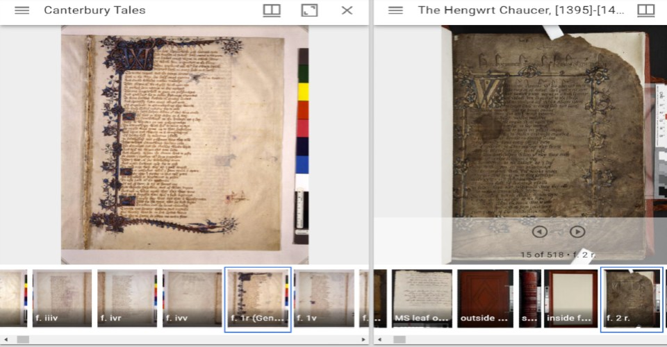

*Published on 27 July 2021 10:00 AM*

<figure markdown="span">

{ width="400" }

<figcaption>Image of Mirador</figcaption>

</figure>

One of the great wonders of the modern internet age is the ability to view and explore medieval manuscripts (and other images) held in distant repositories. The [IIIF protocol](https://iiif.io/){target="_blank"} even makes it possible to compare manuscripts from two different repositories, which is something that I do commonly when I am teaching. A good example is the ability to take a look simultaneously at the two oldest Chaucer manuscripts, the Ellesmere manuscript in the Huntington Library in San Marino, California, and the Hengwrt manuscript in the National Library of Wales. These can easily be viewed side by side using the [Mirador](https://projectmirador.org/){target="_blank"} image viewer. You can go to the Mirador website, enter IIIF manifest urls, and, *voilà*, — up pop the images.

That said, it's much more convenient to have an instance of Mirador with all the image manifests you want pre-loaded. That's pretty easy to set up — it's just a simple webpage with a few lines of Javascript added. In fact, I did that some time ago on my Python-based website.

However, with the transition to [Eleventy](https://11ty.dev/){target="_blank"} as my authoring platform, I tried something a little more ambitious, embedding Mirador inside my template. You can see the result by going to my [my Mirador page](/mirador){target="_blank"}. It might not be immediately obvious what is going on here that is different from a simple web page setup. So here are some things to observe (or not because they are hidden in the code):

1. Mirador appears below my website's header. This proved surprisingly difficult to achieve, apparently because of conflicts with my website's styling. As a result, part of the viewer was hiding underneath my site's navigation menu. That wasn't immediately obvious when looking at the manuscripts, but it became painfully so when viewing the resource listing, where the first row of the table was clearly overlapped by the header. After much experimenting, I discovered what styles to override, but I think I still haven't got it 100% perfect (i.e. looking exactly like vanilla Mirador). But it's still useable and not ugly.
2. Putting Mirador inside my template file means that I don't have edit the javascript to modify the configuration or add new manifest urls. This is handled by the template's front matter in Eleventy, which is easy to configure since it is in YAML format in a separate file. I rather like being able to do this, especially as it keeps my template file fairly uncluttered, but how much of an advantage this will be in maintaining my catalogue of manuscripts remains to be seen. Urls are long, and they create clutter wherever you put them.

Overall, I am happy with the result, and happy that I will have this valuable tool as an integral part of my website. As of this writing, I have pre-loaded the Ellesmere and Chaucer manuscripts, and you can view them on [my Mirador page](/mirador){target="_blank"}. If you haven't used Mirador before, click the Plus icon at the top left to see what other manuscript images I have made available. You can also add any other IIIF url to add additional images (though the viewer will reset when you close or navigate away from the page). I really hope that this convenient version of Mirador helps get my students interested in medieval manuscripts, and I know that it will be valuable in my research.

**Update:** I discovered a small disadvantage to putting Mirador inside my template. This effectively reduces the screen area available to display images. It's not a huge problem since you can switch to full screen mode, but that has a knock-on effect if you are then trying to take a screen shot with a browser-based tool (which you won't be able to access). So it seems that there is an argument for giving Mirador the full screen from the get go. Ideally, I would place a button in the Mirador template to toggle this mode on or off, but that would involve writing a plugin. I don't feel comfortable doing that using Mirador's scanty documentation. My current solution is simple but effective. If you are on the Mirador page, the header is hidden. Having my branding around it was nice, but there just isn't the screen real estate.
