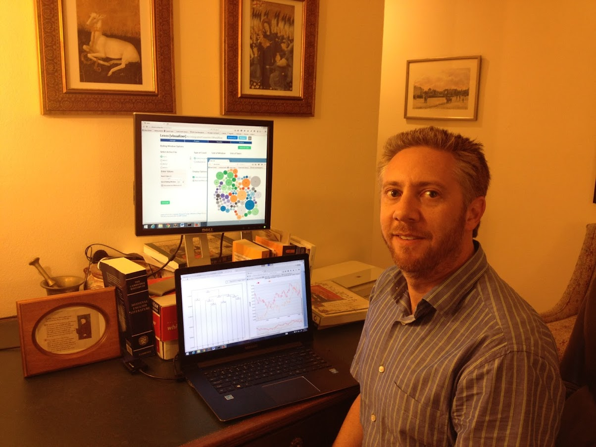

<figure markdown="span">

{ width="400" }

</figure>

I am Professor of [English](http://www.csun.edu/english/){target="_blank"} at [California State University, Northridge](http://www.csun.edu/){target="_blank"}, where I have taught since August 1999. Prior to coming to Northridge, I taught at the [University of Missouri, Columbia](http://www.missouri.edu/){target="_blank"} from 1997-1999. I received my MA at the [University of St Andrews](http://www.st-and.ac.uk/){target="_blank"} in Scotland and my PhD in [Anglo-Saxon, Norse, and Celtic](http://www.asnc.cam.ac.uk/){target="_blank"} from the [University of Cambridge](http://www.cam.ac.uk/){target="_blank"}.

I work on medieval language and literature from the period before the Norman Conquest to the fourteenth century with a special emphasis on Old English and early Middle English. My early work was on the history of the English language during the Old English period, especially the development of phonology and its dialects. More recently I have worked on regional and cultural diversity in historiographical and romance literature.

I have strong interests in using technology for both research and teaching and am working to understand how the growing field of Digital Humanities can expand our knowledge of an access to the cultures of the Middle Ages and how digital methods can open up new questions in the Humanities more broadly. In 2010 I established the [CSUN Center for the Digital Humanities](http://www.csun.edu/digitalhumanities/){target="_blank"}, of which I am currently director.

My Digital Humanities work includes the NEH-Funded [Lexomics Project](http://wheatoncollege.edu/lexomics/){target="_blank"}, which studies literature using digital methods and produces the computational text analysis tool [*Lexos*](lexos.wheatoncollege.edu){target="_blank"}. For more information on my scholarship, see my [Projects](/projects/) and [*Curriculum Vitae*](/cv/) pages.

At Cal State Northridge I teach [courses](/teaching/) on Old and Middle English literature, Chaucer, History of the English Language, and the Digital Humanities. I have also taught a variety of early British survey courses, writing about literature, Tolkien and medievalism, English grammar, and interdisciplinary courses on Scottish Culture and the Early Modern World.
