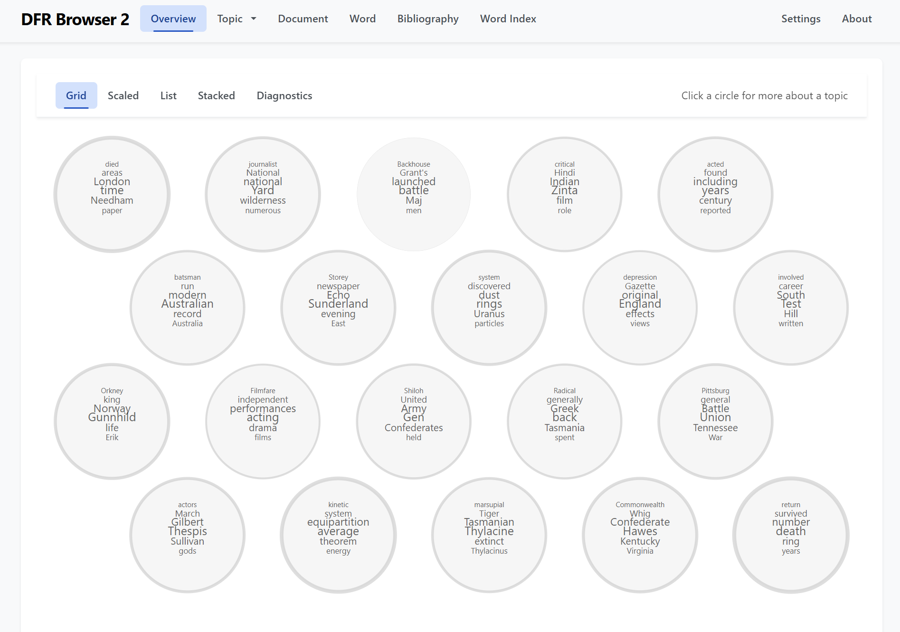
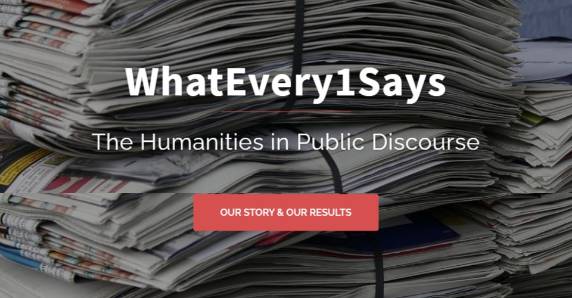
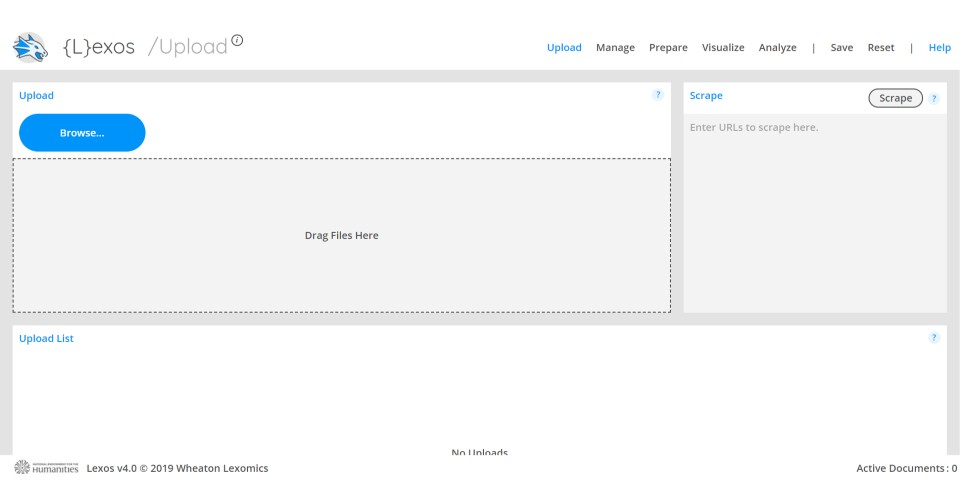
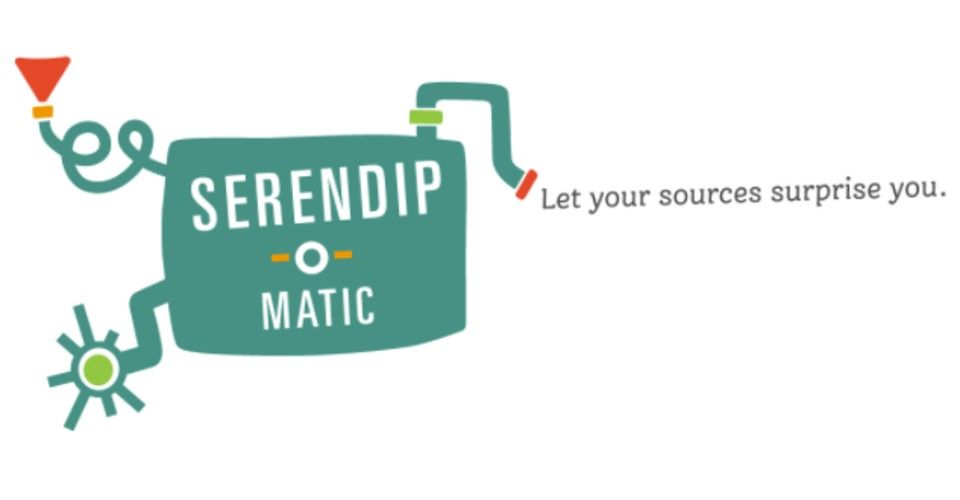

This page is a space to showcase some of the research projects which I have directed or participated in. For a full list of my publications, presentations and other research outputs, see my [curriculum vitae page](../cv.md).

  <a href="/projects/nvs/">
    <figure class="projects-card">
      
      <figcaption>The New Variorum Shakespeare</figcaption>
    </figure>
  </a>

  <a href="/projects/dfrbrowser2/">
    <figure class="projects-card">
      
      <figcaption>Dfr Browser 2</figcaption>
    </figure>
  </a>

  <a href="/projects/whatevery1says/">
    <figure class="projects-card">
      
      <figcaption>WhatEvery1Says</figcaption>
    </figure>
  </a>

  <a href="/projects/lexos/">
    <figure class="projects-card">
      
      <figcaption>Lexos</figcaption>
    </figure>
  </a>

  <a href="/projects/serendip-o-matic/">
    <figure class="projects-card">
      
      <figcaption>Serendip-o-matic</figcaption>
    </figure>
  </a>

