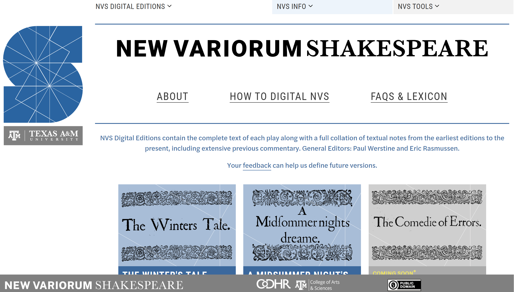

<figure markdown="span">

{ width="500" }

<figcaption>The New Variorum Shakespeare web page</figcaption>

</figure>

The [New Variorum Shakespeare Project (NVS)](https://newvariorumshakespeare.org/){target="_blank"}, which began collating previous editions of Romeo and Juliet in 1871, is now published open-access in digital form and the NVS project is working to digitise all previous volumes in the series. The digital edition has been designed with three main goals: 1) to teach students and early career researchers the concepts behind variorum editing through interface design as well as tutorials; 2) to enable searching across and within volumes and variants using Modern English and major Act-Scene-Line numbers, returning not only exportable lists, text, and bibliographical citations, but also visualizations demonstrating everything from when characters speak in plays to the evolution of variant histories; and 3) to be interoperable with, and allow access to, other major Shakespeare digital resources including bibliographies of criticism, digital copies of editions published since Shakespeare’s time, images, and videos.

I have recently begun work as a technical editor on the project, bringing the expertise in natural language processing and data visualisation I have acquired in my work on [Lexos](/projects/lexos/). The Digital Editor of the NVS project, Katayoun Torabi, is a graduate of the English MA program at CSUN, and one of the first students to study Digital Humanities on our campus. As I make my own contributions to the project, I hope to involve more CSUN students, especially from our new minor in Digital Humanities.
